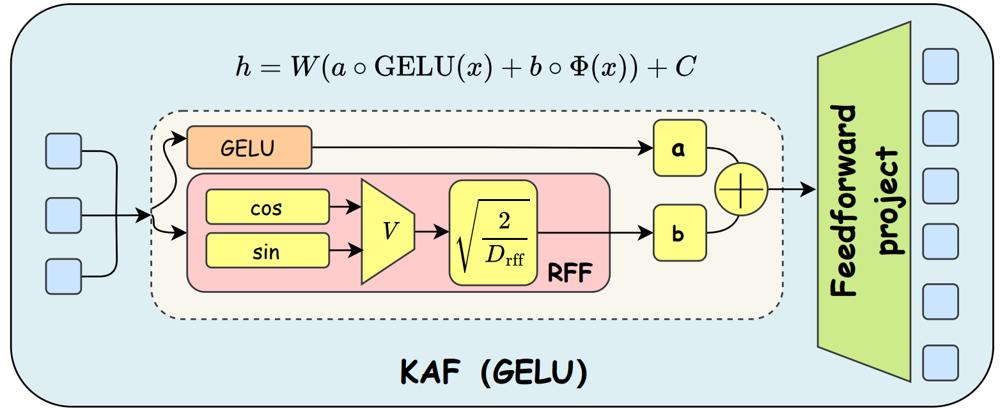
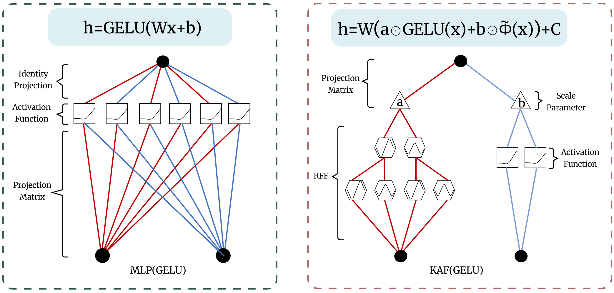

# KAF_icml466_SupplementaryMaterials

## Figure 1: KAF overall framework description

  

## Figure 2: Compare two models : KAF/MLP  (Updated Figure 1)

  

## Table 1: Comparison of Experiment 4.2 after regularization is turned on

  <table>
    <thead>
      <tr>
        <th>MODEL</th>
        <th>DATASETS</th>
        <th>FEATURE MIXER</th>
        <th>#PARAM.</th>
        <th>FLOPS</th>
        <th>TOP-1 (ORIGINAL)</th>
        <th>TOP-1 (W/ REG.)</th>
      </tr>
    </thead>
    <tbody>
      <tr>
        <td>ResNet/18</td>
        <td>CIFAR-10</td>
        <td>MLP</td>
        <td>11.1M</td>
        <td>0.56G</td>
        <td>91.19</td>
        <td>91.32</td>
      </tr>
      <tr>
        <td></td>
        <td></td>
        <td><b>KAF</b></td>
        <td><b>12.0M<b></td>
        <td><b>0.63G<b></td>
        <td><b>91.72<b></td>
        <td><b>91.88<b></td>
      </tr>
      <tr>
        <td></td>
        <td></td>
        <td>GPKAN</td>
        <td>11.3M</td>
        <td>0.56G</td>
        <td>90.98</td>
        <td>91.15</td>
      </tr>
      <tr>
        <td></td>
        <td></td>
        <td>FAN</td>
        <td>8M</td>
        <td>0.42G</td>
        <td>90.69</td>
        <td>90.82</td>
      </tr>
      <tr>
        <td></td>
        <td></td>
        <td>KAN</td>
        <td>-</td>
        <td>-</td>
        <td>-</td>
        <td>-</td>
      </tr>
      <tr>
        <td>MLP_Mixer/S</td>
        <td>ImageNet1k</td>
        <td>MLP</td>
        <td>18.2M</td>
        <td>3.8G</td>
        <td>63.5</td>
        <td>63.7</td>
      </tr>
      <tr>
        <td></td>
        <td></td>
        <td><b>KAF</b></td>
        <td><b>18.8M<b></td>
        <td><b>4.2G<b></td>
        <td><b>64.7<b></td>
        <td></td><b>65.0<b></td>
      </tr>
      <tr>
        <td></td>
        <td></td>
        <td>GPKAN</td>
        <td>18.8M</td>
        <td>4.0G</td>
        <td>62.9</td>
        <td>63.2</td>
      </tr>
      <tr>
        <td></td>
        <td></td>
        <td>FAN</td>
        <td>15.7M</td>
        <td>3.2G</td>
        <td>58.2</td>
        <td>58.6</td>
      </tr>
      <tr>
        <td></td>
        <td></td>
        <td>KAN</td>
        <td>-</td>
        <td>-</td>
        <td>-</td>
        <td>-</td>
      </tr>
      <tr>
        <td>ViT-T/16</td>
        <td>ImageNet1K</td>
        <td>MLP</td>
        <td>5.7M</td>
        <td>1.08G</td>
        <td>72.3</td>
        <td>72.5</td>
      </tr>
      <tr>
        <td></td>
        <td></td>
        <td><b>KAF</b></td>
        <td><b>5.9M<b></td>
        <td><b>1.12G<b></td>
        <td><b>73.2<b></td>
        <td><b>73.5<b></td>
      </tr>
      <tr>
        <td></td>
        <td></td>
        <td>GPKAN</td>
        <td>5.7M</td>
        <td>1.13G</td>
        <td>74.6</td>
        <td>74.8</td>
      </tr>
      <tr>
        <td></td>
        <td></td>
        <td>FAN</td>
        <td>4.2M</td>
        <td>0.96G</td>
        <td>65.7</td>
        <td>66.0</td>
      </tr>
      <tr>
        <td></td>
        <td></td>
        <td>KAN</td>
        <td>-</td>
        <td>-</td>
        <td>-</td>
        <td>-</td>
      </tr>
      <tr>
        <td>MLP_KAN (Deit)</td>
        <td>Cifar100</td>
        <td>MLP</td>
        <td>1.3M</td>
        <td>0.12G</td>
        <td>49.0</td>
        <td>49.3</td>
      </tr>
      <tr>
        <td></td>
        <td></td>
        <td><b>KAF</b></td>
        <td><b>1.4M<b></td>
        <td><b>0.15G<b></td>
        <td><b>53.8<b></td>
        <td><b>54.2<b></td>
      </tr>
      <tr>
        <td></td>
        <td></td>
        <td>KAN</td>
        <td>1.9M</td>
        <td>0.19G</td>
        <td>51.2</td>
        <td>51.6</td>
      </tr>
      <tr>
        <td></td>
        <td></td>
        <td>GPKAN</td>
        <td>1.4M</td>
        <td>0.14G</td>
        <td>54.3</td>
        <td>54.6</td>
      </tr>
      <tr>
        <td></td>
        <td></td>
        <td>FAN</td>
        <td>1M</td>
        <td>0.1G</td>
        <td>46.7</td>
        <td>47.1</td>
      </tr>
    </tbody>
  </table>

